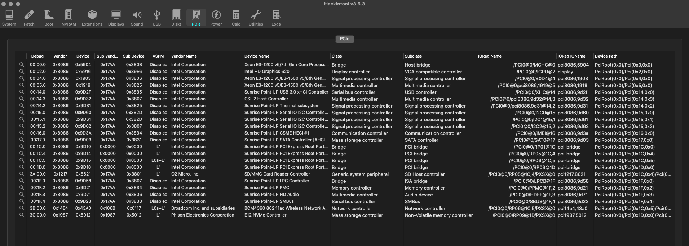

# Lenovo MIIX 720 Hackintosh

EFI for Lenovo MIIX 720 with OpenCore 0.6.9 bootloader

### Computer Spec:

| Component        | Brank                                  |
| ---------------- | ---------------------------------------|
| CPU              | Intel® Core™ i5-7200U                  |
| iGPU             | Intel® HD Integrated Graphics 620      |
| Audio            | Realtek ALC236                         |
| Ram              | 8 Gb ddr4 2400 Mhz                     |
| Wifi + Bluetooth | Broadcom BCM4360                       |
| Nvme             | Silicon Power 512 GB.                  |
| Card Reader.     | microSDXC Card Reader                  |
| SmBios           | MacBook Pro 14,1                       |
| BootLoader       | OpenCore                               |

## Peripherals

### What works and What doesn't or WIP:

- [x] Intel® HD Integrated Graphics 620
- [x] ALC236 Internal Speakers
- [x] All USB Ports 
- [x] SpeedStep / Sleep / Wake
- [x] Broadcom BCM4360
- [x] microSDXC Card Reader
- [x] NVRAM
- [ ]TrackPad (my trackpad it's broken and i've not tested)

### BIOS Settings:
To start, choose "Load Defaults" .

Then change:
- Configuration->SATA Controller Mode, AHCI
- Configuration->DPTF Off
- Configuration->TBT Security Level, No Security
- Security->TPM function, off
- Security->Intel SGX, disabled
- Security->Secure Boot, off
- Boot->Boot Mode, UEFI
- Boot->Fast Boot, Off

### Benchmark :

### Special Config :

- Usb port mapping performed
- Disabled unused device
- CFG Lock 
	- CFG Lock, VarStoreInfo (VarOffset/VarName): 0x3C, VarStore: 0x3, QuestionId: 0x13A, Size: 1, Min: 0x0, Max 0x1, Step: 0x0 {05 91 67 02 68 02 3A 01 03 00 3C 00 10 10 00 01 00}
0x5D1CF       One Of Option: Disabled, Value (8 bit): 0x0 {09 07 04 00 00 00 00}
0x5D1D6       One Of Option: Enabled, Value (8 bit): 0x1 (default) {09 07 03 00 30 00 01}
0x5D1DD     End One Of {29 02} 
With ru.efi tool change on CpuSetup the registry 0x3C with 00 value

- DVMT
	- With ru.efi tool change in SaSetup  change Total Gfx Mem 0xE0 with 03 

	- change Pre-Allocated 0xDF with 02 

### SSDT Info

See [ioreg](./log.ioreg) for more clarification

## Credits

- [Apple](https://apple.com) for macOS;
- [Acidanthera](https://github.com/acidanthera) for OpenCore and all the lovely hackintosh work.
- [Dortania](https://github.com/dortania) For great and detailed guides.
- [Hackintoshlifeit](https://github.com/Hackintoshlifeit) Support group for installation and post installation.

# If you need help please contact us on [Telegram](https://t.me/HackintoshLife_it) 
